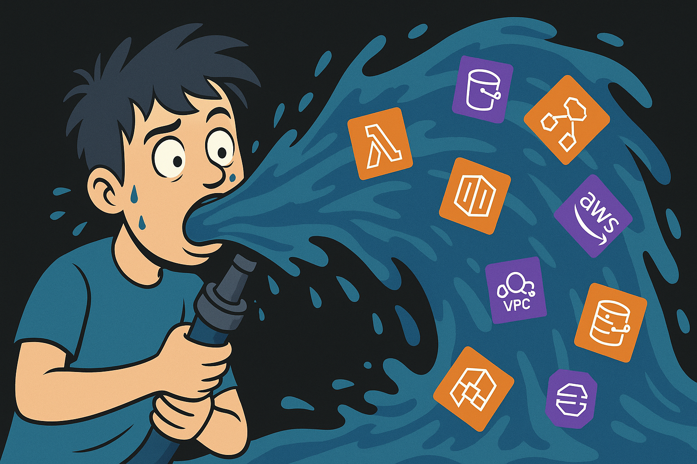

<style>
/* @theme elasticscale-theme */

@import 'https://fonts.googleapis.com/css2?family=Inter:wght@400;600&display=swap';

/* ElasticScale Theme with Hosted At Aero Fonts */
@font-face {
  font-family: 'At Aero';
  src: url('https://elasticscale.com/fonts/AtAero-Bold.woff2') format('woff2'),
       url('https://elasticscale.com/fonts/AtAero-Bold.woff') format('woff');
  font-weight: 700;
  font-style: normal;
  font-display: swap;
}

@font-face {
  font-family: 'At Aero';
  src: url('https://elasticscale.com/fonts/AtAero-Regular.woff2') format('woff2'),
       url('https://elasticscale.com/fonts/AtAero-Regular.woff') format('woff');
  font-weight: 400;
  font-style: normal;
  font-display: swap;
}

@font-face {
  font-family: 'At Aero';
  src: url('https://elasticscale.com/fonts/AtAero-Light.woff2') format('woff2'),
       url('https://elasticscale.com/fonts/AtAero-Light.woff') format('woff');
  font-weight: 300;
  font-style: normal;
  font-display: swap;
}

@font-face {
  font-family: 'At Aero';
  src: url('https://elasticscale.com/fonts/AtAero-RegularItalic.woff2') format('woff2'),
       url('https://elasticscale.com/fonts/AtAero-RegularItalic.woff') format('woff');
  font-weight: 400;
  font-style: italic;
  font-display: swap;
}

:root {
  --color-dark: #24272A;
  --color-gray: #53575A;
  --color-light: #DDDDDE;
  --color-accent: #FFB600;
  --color-highlight: #3957AA;
  --font-header: 'At Aero', 'Segoe UI', sans-serif;
  --font-body: 'Inter', sans-serif;
}

/* Base slide styling */
section {
  font-family: var(--font-body);
  background-color: white;
  color: var(--color-dark);
  padding: 2em;
}

/* Typography */
h1, h2, h3 {
  font-family: 'At Aero', sans-serif;
  color: var(--color-dark);
  font-weight: bold;
}

h1 {
  font-size: 1.9em;
  padding-bottom: 0.3em;
}

h2 {
  font-size: 1.6em;
  color: var(--color-highlight);
}

h3 {
  font-size: 1.5em;
  color: #DDDDDE;
}

/* Links */
a {
  color: #FFB600;
  text-decoration: underline;
}

/* Inline code */
code {
  background-color: var(--color-accent);
  padding: 0.2em 0.4em;
  border-radius: 4px;
  font-size: 0.9em;
}

/* Lead slide (dark) */
section.lead {
  background-color: var(--color-dark);
  color: white;
  background-repeat: no-repeat;
  background-position: left bottom;
  background-size: 80px;
}

section.lead h1,
section.lead h2 {
  color: var(--color-accent);
}
</style>

# From Developer to Cloud Engineer  
### First Three AWS Maturity Levels

**Docker · ECS Fargate · Terraform**

---



---

## Today's Journey

1. **The Gap**: Why infrastructure feels different from app development
2. **The Framework**: Three clear AWS maturity levels to follow
3. **The Path**: Practical steps to become cloud-comfortable
4. **The Tools**: Docker, ECS Fargate, and Terraform fundamentals
5. **Next Steps**: Resources and realistic growth opportunities

> My goal: Help you build a **bridge** from development to cloud infrastructure

---

## About Me: From Code to Cloud

- I started as a developer — mostly PHP & Laravel  
- Led engineering teams at startups and scaleups  
- Previously founder of Dataswitcher (exit in 2024)
- Now founder of ElasticScale — AWS specialists focused on SaaS companies  
  
---

## My AWS Journey: The Reality

- **December 2018**: Started with ElasticBeanstalk thinking "how hard can it be?"
- First deployment: *excitement* → confusion → *panic* → eventual success
- Learned that cloud has **many moving parts**
- Made costly mistakes (left resources running, VPN data transfer explosion)
- Found that step-by-step learning worked better than trying to understand everything
- Now: Comfortable designing complex infrastructure, but still learning daily

> The best path isn't knowing everything—it's knowing how to find what you need

---

## Opening: Why This Talk?

- You're a developer — you understand logic, state, APIs, debugging
- But infrastructure feels like a different world:
  - Slow feedback
  - Poor testing
  - Hard to learn outside of work
- I was overwhelmed at first too (and still sometimes am!)
- This talk helps you build a *bridge* into cloud

---

## Who This Talk Is For

If you are:

- A developer who has **deployed apps** but never owned infra
- Someone who’s **seen AWS Console** but feels lost in IAM, VPCs, or EC2
- Looking to add **DevOps skills** without burning out

> Then you're in the right place 🎯

---

## Developers Make Strong Cloud Engineers

- I hope to excite you with this talk to take your first steps in AWS
- Deep understanding of abstraction and control flow
- Comfort with tools, automation, and debugging
- You already think in *systems* — infrastructure is just another layer
- DevOps ≠ development — it's thinking broadly about delivery and operations

> Similar to programming languages, people in infra also have biases!

---

## What Makes Infra Hard?

- **You can't really test it locally**
- Feedback is *delayed* — requires apply/deploy
- Errors can cost money
- Most tutorials skip the messy stuff (networking, state, permissions)
- Complexity layers build on other complexity layers
- AWS teaches you wrong things (ie. use the console in their docs)

---

## Framework: 3 Maturity Levels

- **Level 1:** Containerize it (Docker)
- **Level 2:** Run it in the cloud (ECS Fargate)
- **Level 3:** Automate it (Terraform)
- Everything beyond that? You'll learn *by doing* — internships, jobs, real-world constraints

---

## Stay Focused, Learn with Purpose

Learning AWS can feel like drinking from a firehose.

> ❌ Don't try to master *everything*  
> ✅ Focus on *what you need right now*

📌 Example:  
- Learn ECS Fargate  
- You'll *encounter* VPC  
- First ask: *What is a VPC?*

---

## One Layer at a Time

- Don't dive into VPC endpoints, NAT gateways, routing tables  
- Until you *need* them for your app
- Trust that you will learn all these things in level 4 and above

> 🧠 Learn just-in-time, not just-in-case

Let your real-world use cases guide the direction of your learning

---

## Protect Your Wallet First

- Create a free AWS account
- **Important:** Set up a $0 budget alert immediately
  ```
  AWS Console → Budgets → Create → Zero-spend budget
  ```

---

## Common Beginner Pitfalls in AWS

❌ Leaving resources running = surprise bill  
❌ Using root credentials for daily work
❌ Skipping IAM roles and relying on “admin access”  
❌ Not using budget alerts

> The cloud is powerful — but **also very easy to misuse**

---

## Essential Security Practices

- **ECS**: Task-specific IAM roles, no access keys
- **Network**: Restrict firewall rules by your IP initially
- **Root user**: Only use the root user for your initial signin, IAM user after

> Security isn't extra—it's fundamental at each step

---

## Level 1: Run It Locally with Docker

**Goal:** Build consistent, portable apps

**Learn:**
- Dockerfile syntax
- `docker build`, `docker run`, exposing ports
- Container debugging

**Unlearn:**
- “It works on my machine” — local ≠ production

---

## Level 1 – Code Snippet

We've made a simple PHP application (see repository)

1. Dockerize the PHP application
2. Use the PHP/Apache image
3. Bonus-point #1: Use docker compose
4. Bonus-point #2: Use PHP-FPM and nginx instead

> Stuck? Check how Laravel is Dockerized

---

## Why Move From Docker to ECS?

You’ve got a working container. Great!

But to run it for real users, you'll need:

- A **scalable hosting solution**
- **Networking** that exposes it to the internet
- **Logs and monitoring** when things go wrong

> That's where ECS Fargate comes in.

---

## Level 2: Deploy It to the Cloud (ECS Fargate)

**Goal:** Run your container in production

**Learn:**
- IAM roles and policies (basic access model)
- ECS Task Definitions, Clusters, Services
- Security groups and public subnets

**Unlearn:**
- "Cloud setup needs to be perfect from day one"

---

## Level 2 – Console Flow

1. Push image to ECR
2. Create ECS Cluster
3. Define task (image, CPU/memory, port)
4. Create service and assign it to public subnet + load balancer
5. Use CloudWatch for logs

**Outcome:** Your app runs in production, no server management

> Stuck? Use [AWS Copilot](https://aws.github.io/copilot-cli/) and see how it deploys

---

## Why ECS Fargate?

- Abstracts away EC2
- No nodes, no patching hosts
- Pay-per-task
- Ideal for small teams or devs getting started
- Easier than EKS/Kubernetes
- Note - no free tier!

---

## Why Move From ECS to Terraform?

Your app runs in the cloud now — nice!  
But how do you...

- Recreate it for staging or a teammate?
- Track changes over time?
- Avoid “ClickOps” drift?
- Apply it again, consistently, in another region?

> That’s where **Infrastructure as Code** (IaC) comes in 

---

## Level 3: Automate It with Terraform

**Goal:** Reproducible, version-controlled infrastructure

**Learn:**
- Terraform CLI basics: `init`, `plan`, `apply`, `destroy`
- Resource definitions: ECS, IAM, VPC
- Terraform state management

**Unlearn:**
- That clicking through the AWS Console (ClickOps) is a scalable strategy


---

## Level 3 – Terraform Code

1. Write Terraform code to deploy:
   1. An ECS cluster
   2. An ECS service
   3. A single ECS task in a public VPC subnet (with public IP)

> Stuck? See the repo for a starter template (but try yourself first!)

---

## Beyond Level 3: Learn in the Wild

- Networking (private subnets, public subnets, NGW)
- CI/CD tools (GitHub Actions, CodePipeline)
- Metrics & logs (CloudWatch, Datadog)
- Advanced IAAC automation (Terragrunt) or different tools (CloudFormation)
- Security (WAF, IAM boundaries, secrets management)
- Team-specific architecture (EKS, Kafka)

These only make sense **in context**, working with a team or during an apprenticeship

---

## Realistic Next Steps

- Containerize a real app (yours or opensource) - tip try N8n
- Deploy manually, then automate with Terraform
- Apply for DevOps internships or shadowing roles
- Pair with a senior DevOps engineer

---

## Realistic Timeline

| Level | From Tutorial to Confidence |
|-------|---------------------------|
| Docker | 1-2 weeks of daily use |
| ECS Fargate | 3-4 weeks |
| Terraform | 1-2 months |

> Progress happens in small steps, not overnight

---

## Learning Resources

- [Adrian Cantrill courses - 20% discount](https://learn.cantrill.io?referral_code=ZA76JJ)
- [AWS Skill Builder - many free](https://skillbuilder.aws/)

Start with Adrian Cantrill's free Tech Fundamentals Course & then with Skill Builder. Aim to get your first AWS Certificate (Cloud Practitioner) to learn about the services available. Plan the date first, then start learning!
 
---

## Real life case-study - Worldatlas.com

- Dockerized their PHP8 Symfony app
- Performance tuning (Nginx, PHP-FPM, Varnish, Redis)
- Autoscaling Fargate & serverless Aurora
- 350 million requests per month

---

## Direct support?

Try these [perplexity.ai](https://www.perplexity.ai/) searches:

🔍 terraform ecs fargate public subnet
🔍 aws copilot tutorial
🔍 cloudwatch log group missing logs
🔍 terraform output values example

> Don’t memorize — learn what to search!

---

## Final Checklist: Your First Cloud Deployment

✅ Containerize your app with Docker  
✅ Deploy it to ECS Fargate manually  
✅ Automate deployment with Terraform  
✅ Protect your wallet with budget alerts  
✅ Learn from mistakes and keep iterating

> You don’t need to know everything. You just need a **path**.

---

## Slides + instructions

You can find the slide deck + resources to get started here:

 

---

## Let's Keep in Touch

If you're curious about DevOps or cloud and want to take your **first real steps**, I'm happy to help.

Just reach out — even if you're unsure where to begin or when you are frustrated about your progress. 📬 **alex@elasticscale.com**

Also add me on LinkedIn for bi-weekly AWS tips:

 

